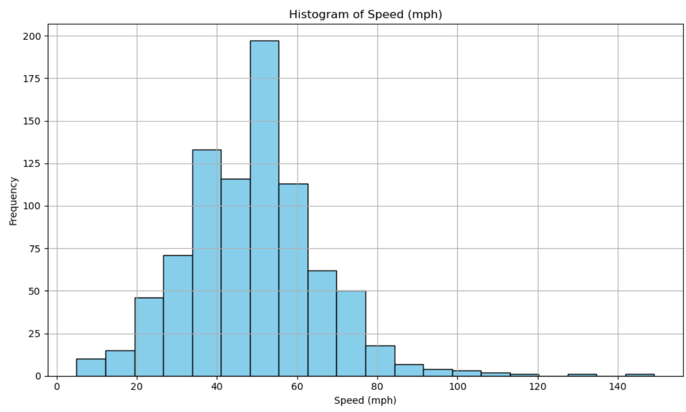

# Data Analysis Project

## Introduction
This project demonstrates a step-by-step approach to data analysis, including data collection, loading, exploratory data analysis (EDA), data cleaning, preprocessing, splitting, and visualization.

## Steps

###  1. Define the Problem
Identify the objective and goals of the analysis.
- **Objective**: Understand the dataset and prepare it for predictive modeling.
- **Goals**: Clean the data, perform EDA, and prepare the data for model training.

###  2. Data Collection
Gather data from relevant sources.
- **Source**: https://www.kaggle.com/datasets/robikscube/rollercoaster-database
- **Description**: Brief description of the dataset and its features.

###  3. Data Loading
Load the data into a suitable format (e.g., CSV, Excel, database).
- Ensure the data is loaded correctly for further analysis.

There is data with little exploration: [Understand Basics](DataUnderstanding.py).

### 4.  Exploratory Data Analysis (EDA)
Understand the structure and content of the data using summary statistics and visualizations.
- **Summary Statistics**: Analyze basic statistical properties of the data.
- **Visualizations**: Use plots to explore data distribution and relationships.

[Understand Basics](DataUnderstanding.py) this is enough EDA for this data

### 5.  Data Cleaning, Data Preprocessing
Handle missing values, remove duplicates, and correct data types.
- **Missing Values**: Decide on strategies to handle missing data.
- **Duplicates**: Identify and remove duplicate entries.
- **Data Types**: Ensure all data types are correctly assigned.

[Preprocess Data](DataPreparation.py) clean data, make it ready for visualization and predictions

### 6.  Data Visualization
Visualize data to identify patterns and insights using plots like histograms, scatter plots, and box plots.

Let's visualize data (:

**Histogram Of Speed:** 

**Bar Chart Of Year Introduced:** 

**Kernel Density Estimate(KDE) Of Speed:** 

## 🔜  Next Steps
The data is now clean and ready for model selection and prediction. In the next steps, we will:
- Choose appropriate machine learning models.
- Train the models on the training data.
- Evaluate model performance using various metrics.
- Fine-tune model parameters to improve performance.
- Make predictions on the testing data.
- Deploy the model for production use.

Stay tuned for further updates, Happy Coding!

